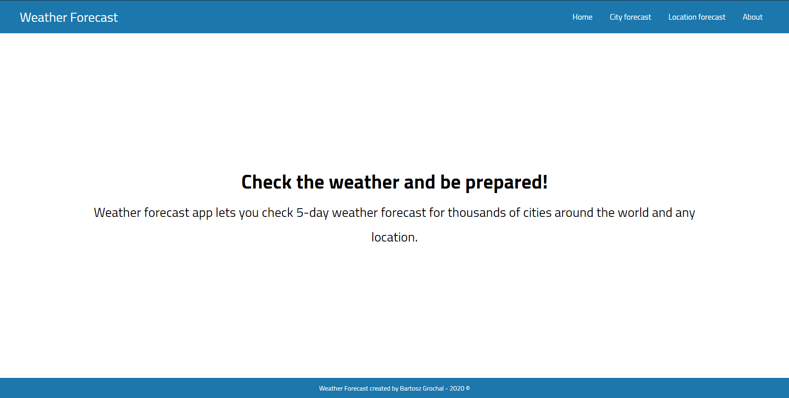
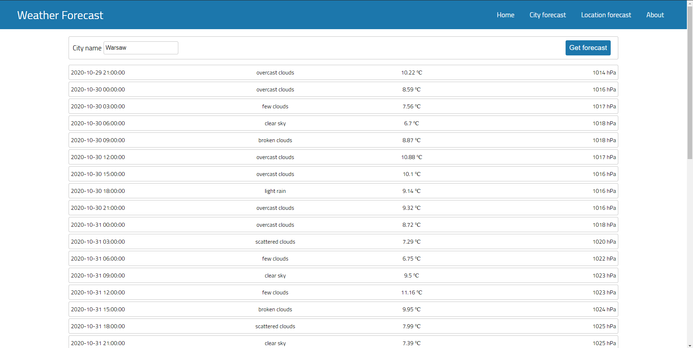
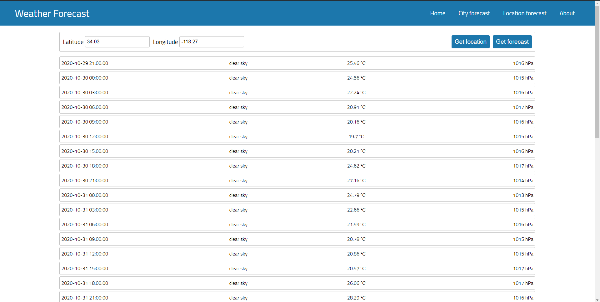
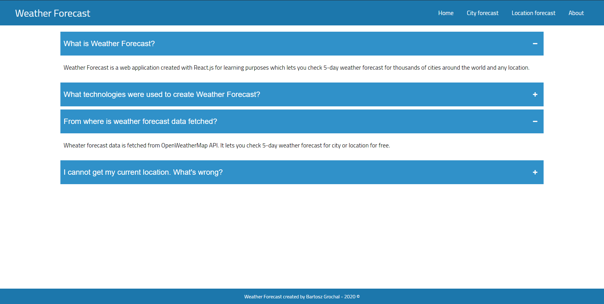

# Weather Forecast
> A web application used to check 5-day weather forecast, built with React.js.

## Table of contents
* [General info](#general-info)
* [Screenshots](#screenshots)
* [Technologies](#technologies)
* [Setup](#setup)
* [Features](#features)
* [Live demo](#live-demo)
* [Status](#status)

## General info
Weather Forecast is a web application which lets you check 5-day weather forecast for thousands of cities around the world and any location. Application was built with React.js framework and additional libraries: React Router for routing and Axios for fetching weather forecast data from OpenWeatherMapAPI. Project is based on functional components with hooks. Data fetched from Web API is shared among components through React's Context API. Whole layout was created with vanilla CSS to boost styling skills. Componets’ logic was implemented in JavaScript. Project was created for learning purposes to get more familiar with React.js framework.

## Screenshots

## Technologies
* React.js 16.13.1
* React Router 5.2.0
* Axios 0.20.0

## Setup
Clone down this repository. You will need `node` and `npm` installed globally on your machine.  

Installation:

`npm install`  

To Start Server:

`npm start`  

To Visit App:

`localhost:3000`  

## Features
* Get 5-day weather forecast for city by entering city name
* Get 5-day weather forecast for location by entering latitude and logitude

## Live demo
Check the live demo of application by clicking on the link: [Weather Forecast Live Demo](https://gracious-dijkstra-07b885.netlify.app/).

## Status
Project is _finished_ at this moment but there are possible updates and improvements in the future.
